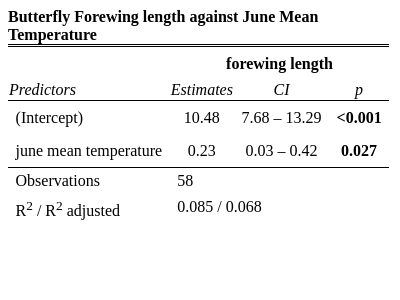
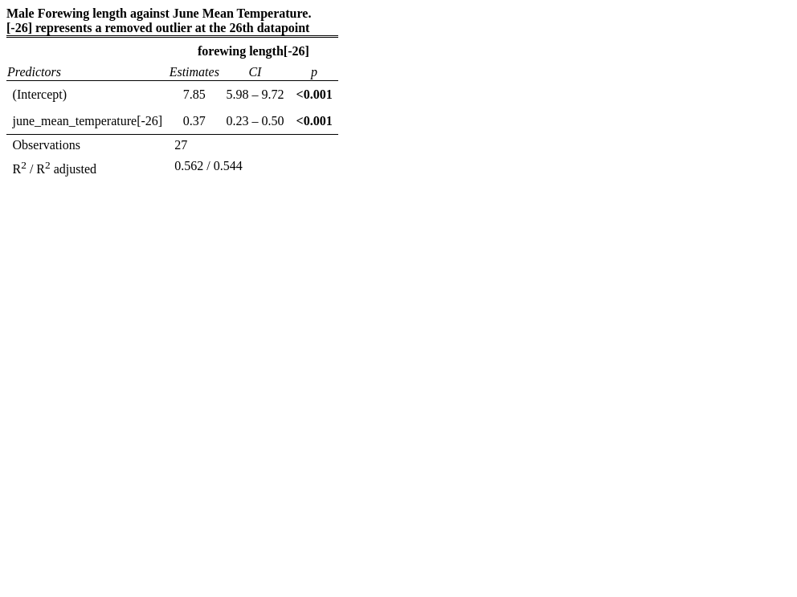
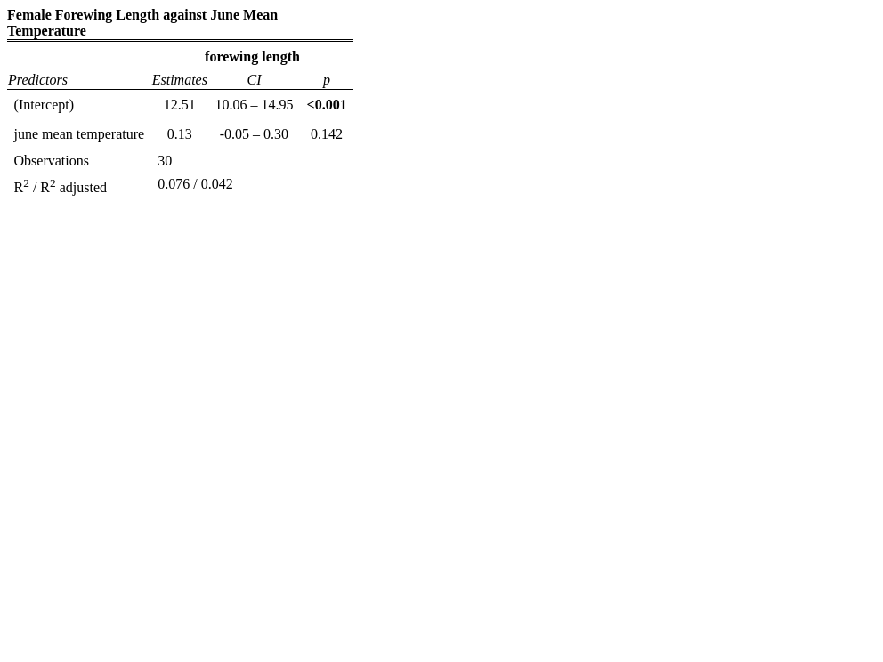

```{r setup, read-data, include=FALSE, echo=FALSE}
knitr::opts_chunk$set(echo = TRUE)

source("Scripts/01_import_unvoltine_butterfly_data.R")
source("Scripts/02_tidy_univoltine_butterfly_data.R")
source("Scripts/03_exploratory_analysis.R")
source("Scripts/04_male_butterfly_linear_model.R")
source("Scripts/05_female_butterfly_linear_model.R")
source("Scripts/06_butterfly_plots.R")
source("Scripts/07_model_summaries.R")
```

[**Introduction**]{.underline}

The Silver-spotted Skipper (*Hesperia comma*) is a butterfly species found in the United Kingdom. *Hesperia comma* resides in southern England, considered a rare species in the UK (Lawson et al., 2013). The species occurs in discrete colonies on open, sunny, short chalk grassland, where their larval foodplant, Sheep's Fescue (Festuca ovina), grows next to patches of bare ground (Lawson et al., 2013). However, in recent years, the Silver-spotted Skipper has extended its range to previously unoccupied sites and has been observed egg-laying in short grassland despite the absence of bare ground, as a response to a warmer climate and microclimate in the areas where it breeds

The butterfly's declining status resulted from the widespread reduction of sparse, short-turfed calcareous grassland containing the species' sole larval host plant, sheep's fescue grass Festuca ovina L. (Thomas et al., 1986). By 1982, rabbits had recovered, but the *Hesperia comma* population had not recolonized former sites. • Between 1982 and 1991, the number of populated habitat patches increased by 30% in the South and North Downs, primarily within East Sussex. (Thomas and Jones, 1993).

Studies have reported that *Hesperia comma* changes habitats in association with climate change -- finding that the optimum percentage of bare ground within the habitat used for egg-laying shifted from 41% to 21% due to climate change (Davies et al., 2006). The study also found that females adjust microhabitat usage in response to temperature variations. Climate warming has increased the availability of thermally suitable habitat for *H. comma* at the cool, northern edge of the species distribution, potentially increasing the rate of population increase and the number of habitat patches in the landscape currently available for colonies. In addition, another study found that temperature variation during different life stages of a butterfly species can affect changes in body size and phenology. Specifically, June temperatures affect adult body size, while July temperatures affect the timing of adult emergence. The study also suggests that August temperatures, which act on the adult stage, correlate to range change. (Fenberg et al.).


[**Analysis**]{.underline}

This study follows up upon those findings, investigating how environmental changes, particularly temperature in June, affected the species size as a direct result of climate change. I used an ordinary least squares linear model to analyse forewing length, with June mean temperature as the numerical predictor. The best-fitting model explaining forewing length included only June mean temperature as the only significant contributor. R version 4.2.3 was used . Additionally, This study uses R packages: tidyverse, for data importing, data tidying, exploratory data analysis, and data wrangling; ggpubr for visual model summaries; ISLR to spot anomalies using cook's distance; ggExtra to display additional graphics; GGally for scatter matrices; performance to create model checking plots; MASS to produce model checking boxcox plots; KableExtra and gt to produce model tables; ggthemes for ggplot themes; colorblindr to test for colour blindness; and sjplot to create model summary tables; webshot2 to produce a visual model summary table images; knitr and rmarkdown to produce a Rmarkdown document. I obtained the data by collecting museum samples of the Silver Spotted Skipper and comparing them against the measured weather data of each year.

To analyse the data, I used Cook's distance transformations to remove outliers from the linear model from the male butterfly dataset. I also used box Cox plots and model-checking plots to assess each model fit. I used the Pearson correlation coefficient test to assess the strength and significance of each linear model. 

I checked for normality within the datasets as sample sizes were 28 observations for males and 30 observations for Females. Using a Shapiro test, I found that forewing length was normally distributed in males (95% CI; W = 0.98003, p-value = 0.851) and female forewing length was also normally distributed (95% CI; W = 0.96938, p-value = 0.5223). The table below shows the dataset.

```{r figure-1-table, dataset, echo=FALSE}
butterfly %>% head(n=58) %>% gt::gt()

```
*Figure 1:  **Hesperia Comma dataset**. Data was obtained by analysing museum specimens in accordance with the climate they lived in.*

[**Results**]{.underline}:

I hypothesised a positive linear relationship between forewing length and mean June temperature across all *Hesperia comma* because juvenile hormones, ecdysteroids, and other signalling molecules are critical for proper growth and development in butterfly genes involved in growth and development (Jindra, Palli and Riddiford, 2013), as well as genes responsible for the insulin/insulin-like growth factor (IGF) signalling pathway, which are also involved in growth (Shingleton et al., 2007). To evaluate this, I used an ordinary least squares model (OLS) with June mean temperature as a factorial predictor and forewing length as an ordinal scale. From this, I used a Pearson Correlation Coefficient test to assess the significance and strength of the OLS model. Results show a significant, weak positive linearity between June Mean Temperature and Forewing Length. This model suggests that for every 1 OC  increase, butterfly forewing length increases by 0.23 cm (95% CI 7.68 \~ 13.29; p = 0.027, figure 1). Results may derive from stimulated growth hormones in response to heat. Comparable results are observed in other species, including Lycaenidae (Celastrina argiolus), Nymphalidae (Polygonia c-aureum), Papilionidae (Atrophaneura alcinous, Papilio macilentus, Parnassius stubbendorfii), and Pieridae (Colias erate, Pieris canidia, Pieris dulcinea, Pieris rapae) (Na et al., 2021), indicating a general trend in molecular biology. However, results are inconsistent with studies finding size increases at lower temperatures for Lycaena tityrus (Karl and Fischer, 2007). This suggests that although a trend, growth in response to temperature is not a universal law across all ectotherms. Plots shown in figure 2b.

```{r figure-2-table , all-butterflies, echo=FALSE, fig.width=4, fig.height=2}

```
*Figure 2a: **Visual model summary for Hesperia comma Forewing length against June Mean Temperature across all samples**. Samples were placed through an OLS model to analyse body size variations with temperature, the only significant contributor. Predictors indicate the dependent variable (intercept = Forewing length) and independent variable (june mean temperature). CI indicated 95% confidence intervals. Observations indicate sample sizes. R2 and R2-adjusted indicate the strength of regression, scaled between 0 ~ 1. Estimators indicate the mean estimate for each variable. p values indicate significance.*
```{r figure-2-plot, all-butterflies, echo=FALSE, fig.width=8, fig.height=5}
p2
```

*Figure 2b: **Hesperia comma forewing length increases with June temperature**. Slope was fitted as temperature was the only significant contributor (Adj. R2 = 0.068). This model suggests that for every 1 OC temperature increase, butterfly forewing length increases by 0.23 cm (95% CI 7.68 ~ 13.29; p = 0.027). Circles indicate individual observations, the dashed line represents the line of best fit, shaded regions surrounding the line of best fit indicate 95% confidence intervals. Marginal curves indicate density plot distributions for forewing length (right) and June Mean Temperature (top).*


I hypothesised a positive correlation between Male Forewing Length and June Mean Temperature. An OLS model was used to assess if correlation differences exist between Male and Female Silver-spotted skippers. A Pearson correlation coefficient test assessed the strength and significance of this correaltion. The analysis showed a strong positive correlation, whereby a 1 OC temperature increase results in a 0.37 cm Forewing length increase (95% CI 0.2338876 ~ 0.5015223; p < 0.001; Figure 2; Adj. R2 = 0.544). Similar results are observed in studies examining the effects of temperature on body size and mass of male and female butterflies in the genius Colias (Kingsolver, Diamond and Buckley, 2013). Results may derive from upregulated ecdysteroid or ecdysone genes in response to increased temperature. Trends shown in Figure 3b.

```{r figure-3, echo=FALSE,fig.width=4, fig.height=2}

```
*Figure 3a: **Visual model summary for Male Forewing length against June Mean Temperature**. Samples were placed through a reduced OLS model, whereby temperature was the only significant contributor. Predictors indicate the dependent variable (intercept = Forewing length) and independent variable (june mean temperature). CI indicated 95% confidence intervals. Observations indicate sample sizes. R2 and R2-adjusted indicate the strength of regression, scaled between 0 ~ 1. Estimators indicate the mean estimate for each variable. p values indicate significance. [-26] represents a removed outlier at row=26*
```{r figure-3-plot, echo=FALSE, fig.width=8, fig.height=5}
p3
```

*Figure 3b: **Male Hesperia comma forewing length increases with temperature**. The fitted slope is from the reduced linear model (the only significant factor being June Mean Temperature) excluding outliers (Adj. R2 = 0.5441). This model suggests that for every 1-degree Celsius temperature increase, male forewing length increases by 0.37 cm (95% CI 0.2338876 ~ 0.5015223; p < 0.001). Circles indicate individual observations, the dashed line represents the regression line of best fit, shaded regions surrounding the line of best fit indicate regions of 95% confidence, and marginal curves indicate density plot distributions for Forewing length (right) and June Mean Temperature (top).*

I also hypothesised a positive relationship between female forewing length and June Mean Temperature using a Pearson correlation coefficient test and OLS model. However, an insignificant relationship was observed between forewing length and June mean temperature in Female silver spotted skippers (95% CI; p = 0.142, Adj. R2 = 0.042). These results are consistent with a study that found no relationship between environmental temperature and Forewing length (Johnson, 2022). This is also consistent with anothet study showing June temperatures can predict adult body size within only Male *Hesperia comma* (Fenberg et al., 2016). This shows that this is a  trend in biology whereby Female butterflies do not behave similarly to male butterflies. Plots shown in Figure 4b.


```{r figure-4-table, echo=FALSE, fig.width=4, fig.height=2}


```
*Figure 4a: **Visual model summary for Female Hesperia comma Forewing length against June Mean Temperature**. Female Hesperia comma Samples were placed through an OLS model to compare their forewing length against their climate they lived in. Predictors indicate the dependent variable (intercept = Forewing length) and independent variable (june mean temperature). CI indicated 95% confidence intervals. Observations indicate sample sizes. R2 and R2-adjusted indicate the strength of regression, scaled between 0 ~ 1. Estimators indicate the mean estimate for each variable. p values indicate regression insignificance.*
```{r figure-4-plot, echo=FALSE, fig.width=8, fig.height=5}
p4
```

*Figure 4b: **Non-significant positive linear relationship between Female Hesperia comma Forewing Length and June Mean Temperature**. Female silver spotted skipper specimens was collected from museums and measured against the corresponding June mean temperature that they lived in. Slopes were fitted from the reduced linear model as the temperature was the only significant contributing factor (Adj. R2 = 0.042) excluding outliers. However, no significant linear relationship exists between Female forewing length and temperature (95% CI -0.06937291 ~ 0.2545739; p = 0.244). Circles indicate individual observations, the dashed line indicates the regression line of best fit, shaded regions surrounding the line of best fit indicate 95% confidence intervals and marginal curves display distributions for forewing length and temperature, respectively.*

Upon comparing the forewing length between Males and Females using a two-sample t-test, I found a mean forewing length of 14.30458 cm in females (95% CI 14.124618 ~ 14.48455), whereas Males had a mean forewing length of 12.97242 cm, offering a mean 1.332164 cm greater forewing length (95% CI -1.591178 ~ -1.07315; t = 10.3; p < 0.05). Results suggest that June temperature induces the growth factors within the Hesperia comma. However, the same genes and signalling pathways responding to June temperature remain unclear. Further studies may reveal the mechanisms between light and growth factor genes. These results may be due to increased growth factor gene activity. Temperature effects may also result from differences in growth factor activity between the sexes, or the growth factor gene responding to temperature being present on the Y chromosome. Results shown in Figure 5. Results are consistent with a study that found Male *Hesperia comma* had significantly smaller forewing length than their counterpart Females (Thornton and Switzer, 2015). As such, the results of this study are valid.

```{r figure-5-plot, echo=FALSE, fig.width=8, fig.height=5}
p5
```

*Figure 5: **forewing length comparison between Male and Female Hesperia comma**. A two-sample t-test compared the mean forewing length between Male and Female butterflies. Females had a mean forewing length of 14.30458 cm (95% CI 14.124618 ~ 14.478455) whereas Males had a decreased forewing length of 12.97242 cm, indicating a 1.332164 cm difference (95% CI -1.591178 ~ 1.07315; t = -10.303; p < 0.05). Circular points represent individual observations, blue colours represent male butterflies, red points represent female butterflies, and side curves represent the distribution of forewing Length for Male and Female Butterflies (right).*

[**Conclusion**]{.underline}


Results show a weak but significant correlation between forewing length and June Mean Temperature across all butterflies. Results show a strong positive correlation between forewing length and June mean temperature in male butterflies. However, female butterflies do not share this - lacking a significant positive correlation. Results are consistent with studies suggesting that June temperatures only affect male *Hesperia comma* body sizes (Fenberg et al.). This difference may result from upregulated growth factor genes, or the responsible growth factor genes existing on the Y chromosome. However, females may already exhibit excessive growth factors, causing little response to temperature changes. Results open opportunities to analyse genetic mechanisms in response to heat, and 

However, the data only measured mean temperatures and rainfall in June, failing to consider outliers or individual measurements annually. This reduces the available information, removing any understanding of the skewness within the data. This results in data loss and decreased model accuracy. The data measured males and females at arbitrary interval years. Consequently, female butterflies had more data than male butterflies, with male butterflies having twenty-eight samples and female butterflies having 30. This omission places bias towards female butterflies. As such, trends observed may be unrepresentative of the total population. The model assumes the relationship is linear, entailing the assumption of normality, linearity, and no multi-collinearity. Despite this, further data and additional studies may reveal a substantial relationship between forewing length and June mean temperature in Female Butterflies.

[**Reference list**]{.underline}

Reference list

Davies, Z.G., Wilson, R.J., Coles, S. and Thomas, C.D. (2006). Changing Habitat Associations of a Thermally Constrained Species, the Silver-Spotted Skipper Butterfly, in Response to Climate Warming. Journal of Animal Ecology, [online] 75(1), pp.247–256. Available at: https://www.jstor.org/stable/3505486 [Accessed 11 May 2023].

Fenberg, P.B., Self, A., Stewart, J.R., Wilson, R.J. and Brooks, S.J. (2016). Exploring the universal ecological responses to climate change in a univoltine butterfly. Journal of Animal Ecology, 85(3), pp.739–748. doi:https://doi.org/10.1111/1365-2656.12492.

Jindra, M., Palli, S.R. and Riddiford, L.M. (2013). The Juvenile Hormone Signaling Pathway in Insect Development. Annual Review of Entomology, 58(1), pp.181–204. doi:https://doi.org/10.1146/annurev-ento-120811-153700.

Johnson, J.B. (2022). Observations on the common brown butterfly (Heteronympha merope) in the early 1900s in Australia using digitized specimens. Journal of Asia-Pacific Entomology, 25(2), p.101898. doi:https://doi.org/10.1016/j.aspen.2022.101898.

Karl, I. and Fischer, K. (2007). Why get big in the cold? Towards a solution to a life-history puzzle. Oecologia, 155(2), pp.215–225. doi:https://doi.org/10.1007/s00442-007-0902-0.

Kingsolver, J.G., Diamond, S.E. and Buckley, L.B. (2013). Heat stress and the fitness consequences of climate change for terrestrial ectotherms. Functional Ecology, 27(6), pp.1415–1423. doi:https://doi.org/10.1111/1365-2435.12145.

Lawson, C., Bennie, J., Thomas, C., Hodgson, J., Bernhard, T., Budd, P., Daish, A., Edwards, M., Gray, T., Holloway, C., Hoyes, R., McBride, B.J., Poole, J., Silver, H., Yardley, T.M. and Wilson, R. (2013). The status and conservation of the silver-spotted skipper Hesperia comma in South-East England 2000-2009. [online] www.semanticscholar.org. Available at: https://www.semanticscholar.org/paper/The-status-and-conservation-of-the-silver-spotted-Lawson-Bennie/20a00a542e986cac966364aa8100b751ee19d570.

Na, S., Lee, E., Kim, H., Choi, S. and Yi, H. (2021). The relationship of mean temperature and 9 collected butterfly species’ wingspan as the response of global warming. Journal of Ecology and Environment, 45(1). doi:https://doi.org/10.1186/s41610-021-00193-y.

Shingleton, A.W., Frankino, W.A., Flatt, T., Nijhout, H.F. and Emlen, Douglas.J. (2007). Size and shape: the developmental regulation of static allometry in insects. BioEssays, 29(6), pp.536–548. doi:https://doi.org/10.1002/bies.20584.

Thomas, C.D. and Jones, T.M. (1993). Partial recovery of a Skipper Butterfly (Hesperia comma) from Population Refuges: Lessons for Conservation in a Fragmented Landscape. The Journal of Animal Ecology, 62(3), p.472. doi:https://doi.org/10.2307/5196.

Thomas, J.A., Thomas, C.D., Simcox, D.J. and Clarke, R.T. (1986). Ecology and Declining Status of the Silver-Spotted Skipper Butterfly (Hesperia comma) in Britain. The Journal of Applied Ecology, 23(2), p.365. doi:https://doi.org/10.2307/2404023.

Thornton, J.L. and Switzer, P.V. (2015). Factors Affecting the Spatial Distribution of Oviposition Sites for Tandem Black Saddlebags Dragonflies (Odonata: Libellulidae). Journal of Insect Science, 15(1), p.54. doi:https://doi.org/10.1093/jisesa/iev035.
